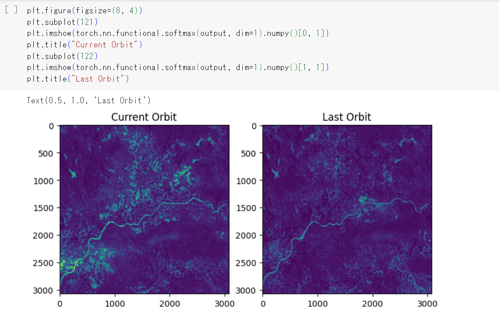

# SAR衛星解析による洪水被害の推定システム



## 1. 概要
本リポジトリでは、2023年度のProject PLATEAUが開発した「SAR衛星解析による洪水被害の推定システム」のソースコードを公開しています。  
「SAR衛星解析による洪水被害の推定システム」は、SAR衛星データを解析して洪水災害等の浸水範囲を解析する機能と、この解析結果と3D都市モデルを活用することで家屋の浸水被害の程度を推定する機能から構築されています。


## 2. 「SAR衛星解析による洪水被害の推定システム」について
SAR衛星データを解析して洪水災害等の浸水範囲を解析する機能は、機械学習モデルを用いて人工衛星観測データ（SARデータ）から浸水範囲を解析します。また、推定した浸水範囲と3D都市モデルの地形モデル及び建築物モデルを組合せることで、家屋単位での浸水深の算出および被災判定を行います。  
本システムで作成したデータの可視化環境として、[SAR衛星解析による洪水被害の推定結果の可視化を行うRe:Earthプラグイン](https://github.com/Project-PLATEAU/reearth-plugin-flooddamage-widget?tab=readme-ov-file)が利用可能となっています。本システムの詳細については[技術検証レポート](https:XXX)を参照してください。


## 3. 利用手順
本システムの構築手順及び利用手順については[利用チュートリアル](https://project-plateau.github.io/SAR-image-based-flood-damage-detector/)を参照してください。  
本システムは実行環境としてGoogle Colaboratoryを想定しています。

## 4. システム概要
### 【GitHubファイルのGoogle Driveへのファイルクローン】
#### Google Driveへのファイルクローン及び環境構築（Git2Colab_Installation_PLATEAU_FloodSAR.ipynb）
- このファイルを実行することで、Google Driveへ本リポジトリをクローンします。
- 人工衛星観測データからピクセル単位の浸水確率を推定する学習モデル（以下、浸水確率学習モデル）をDLします。

### 【人工衛星観測データの解析（メインステップ⓪～④）】
#### ⓪プロジェクトの初期・3D都市モデル（CityGML）の読み込み（0_PrepareProject.ipynb）
- 解析対象となるCityGMLと、対象エリアとなる領域の緯度・経度情報またはポリゴンデータを入力することで、CityGMLを解析して、対象エリアの建物データを生成します。また、国土地理院からデジタル標高モデル（DEM、5mメッシュ）をダウンロードします。

#### ①SARデータの読み込み・SARデータによる浸水確率ラスターデータの推定（1_EstimateSAR-FloodPrbDiff.ipynb）
- Google Earth Engineの認証を行い、対象とする浸水日を指定することで浸水日とその1回帰前のSentinel-1の人工衛星観測データを取得します。
- 取得した人工衛星観測データを使用して、浸水確率学習モデルによりピクセル単位の浸水確率を推定します。
- 浸水時の人工衛星観測データの浸水確率とその1回帰前の人工衛星観測の浸水確率をピクセル単位で差し引きし、浸水時の浸水確率ラスターデータとして出力します。

#### ②浸水ピクセルの生成（2_GeneratePointGroup.ipynb）
- ①で生成した浸水確率ラスターデータを使用して、浸水確率が閾値を超えるピクセルを浸水ピクセルと判定します。
- 以下のパラメータの調整が可能です。

| パラメータ |  内容 |
| ---------- | ---------------------|
| threshold  | 浸水ピクセル判定の閾値 |

#### ③浸水面の標高ラスターデータの生成（3_CalcFloodDEMRaster.ipynb）
- ②で生成した浸水ピクセルから等標高の浸水面を推定し、浸水面の標高ラスターデータを生成します。
- 以下のパラメータの調整が可能です。
  
| パラメータ |  内容 |
| ---------- | ---------------|
| mindepth  | 浸水面の最低水深の設定 |
| maxarea  | 浸水面の最大面積の設定 |
| maxdepth  | 浸水面の最大水深の設定 |

#### ④建物への浸水深付与（4_AssessBuildings.ipynb）
- ⓪で取得した建物データと③で生成した浸水面の標高ラスターデータを使用して、建物毎の浸水深を算出します。
- 各建物の構造種別と浸水深に基づいて、被災カテゴリとして床上浸水か床下判定かの判定を行います。
- 建物データに浸水深と被災カテゴリを追加した被災建物データ（CSV形式）を生成します。

### 【解析結果のアップロード（メインステップ⑤）】
#### ⑤Re:Earth CMSへのアップロード（5_Upload.ipynb）
- ③で生成した浸水面の標高ラスターデータをpng形式の画像タイル及び3D Tiles形式の点群データに変換します。
- ④で生成した被災建物データを集計し、木造家屋の被災カテゴリ別のpng形式のヒートマップ画像タイルを生成します。
- Re:Earth CMS の認証を行った後、上記のデータと④で生成した被災建物データ（CSV形式）をRe:Earth CMSにアップロードします。
- アップロードされたRe:Earth CMSのリンクが以下のように出力される。

```
以下の情報をRe:Earth編集画面に入力してください。
------------------------------------------------
観測日: 2020-07-10
観測衛星: Sentinel-1
浸水深ファクター: 1.0

浸水域・浸水深（3Dタイル）
https://assets.cms.plateau.reearth.io/assets/*/3dtiles/tileset.json

浸水域・浸水深（画像タイル）
https://assets.cms.plateau.reearth.io/assets/*/xyztile/{z}/{x}/{y}.png

建物被災状況（CSVファイル）
https://assets.cms.plateau.reearth.io/assets/*/heatmap_yukaue_mokuzou/{z}/{x}/{y}.png

被災建物・ヒートマップ画像タイル：床上（木造）
https://assets.cms.plateau.reearth.io/assets/*/heatmap_yukaue_mokuzou/{z}/{x}/{y}.png

被災建物・ヒートマップ画像タイル：床下（木造）
https://assets.cms.plateau.reearth.io/assets/*/heatmap_yukashita_mokuzou/{z}/{x}/{y}.png

被災建物・ヒートマップ画像タイル:木造家屋総数
https://assets.cms.plateau.reearth.io/assets/*/heatmap_all_mokuzou/{z}/{x}/{y}.png
```

### 【プログラム】
#### DEMデータの補正用のプログラム（plateau_floodsar_lib.py）
- ⓪、③、④で呼び出されるプログラムです。
- 国土地理院からデジタル標高モデル（DEM、5mメッシュ）をダウンロードし、Google Driveに保存します。
- 複数のタイプのDEMデータ（例：DEM5A、DEM5B）を統合し、ジオイド高さを計算し、指定されたエリアの標高値を抽出および補完します。

### 【GIAJ浸水エリアのGeoJSONファイルの分析（サブステップ）】
#### 国土地理院の浸水推定図（GeoJSON）による浸水面の標高ラスターデータの生成（s1-s3_GIAJ_FloodArea_Raster.ipynb）
- サブステップの1つとして人工衛星観測データではなく、ローカルに保存された国土地理院の浸水推定図（GeoJSON）で動作します。
- GeoJsonから浸水面の標高ラスターデータを生成します。
- メインステップ①〜③を代替します。このファイルを実行した後、メインステップ④で続行してください。
- 国土地理院の浸水推定図とは、災害発生時に国土地理院が収集した画像等と標高データを用いて、浸水範囲における水深を算出して深さを濃淡で表現した地図の輪郭線のことを指します。
- 令和2年7月豪雨の場合、[こちら](https://www.gsi.go.jp/BOUSAI/R2_kyusyu_heavyrain_jul.html)から取得できるものです。

### 【ALOS-2の分析（サブステップ）】
#### ALOS-2の分析（s1_ALOS-2_EstimateSAR-FloodPrb.ipynb）
- サブステップの1つとしてSentinel-1ではなく、Google Driveに保存されたALOS-2のGeoTIFFファイルで動作します。
- ALOS-2 SARデータをGoogle Driveにアップロードし、「tif_path」によりアップロード場所の指定をしてください。
- メインステップ①を代替します。このファイルを実行した後、メインステップ②で続行してください。

### 【ASNARO-2の分析（サブステップ）】
#### ASNARO-2の分析（s1-s2_ASNARO-2_EstimateSAR_FloodPrb.ipynb）
- サブステップの1つとしてSentinel-1ではなく、Google Driveに保存されたASNARO-2のGeoTIFFファイルで動作します。
- ASNARO-2 SARデータをGoogle Driveにアップロードし、「tif_path」によりアップロード場所の指定をしてください。
- メインステップ①～②を代替します。このファイルを実行した後、メインステップ③で続行してください。

## 5. 利用技術

| 種別              | 名称   | バージョン | 内容 |
| ----------------- | --------|-------------|-----------------------------|
| アプリケーション       | [Google Colaboratory](https://colab.research.google.com/?hl=ja) |  | Googleが提供するクラウドベースのJupyterノートブック環境 |
| ライブラリ | numpy | 1.23.5 | 数値情報処理の根幹ライブラリ |
|       | requests | 2.31.0 | APIアクセスに利用 |
|       | progressbar | 4.2.0 | 実行時間の予想と把握のためのライブラリ |
|       | matplotlib | 3.7.1 | グラフ描画ライブラリ |
|       | scipy | 1.11.4 | 数学、科学、工学分野の数値解析ライブラリ |
|       | ee | - | Google Earth Engine (GEE)を利用するためのライブラリ（人工衛星観測データの取得に使用） |
|       | PyTorch | 1.11.0 | Deep Learningフレームワーク（AIの構造定義や学習/判読処理のために使用） |
|       | torchvision | 0.16.0+cu121 | PyTorchプロジェクトに含まれているパッケージ |
|       | MLFlow | 1.26.1 | AI実験管理用ライブラリ（AI学習結果・学習時設定パラメータ管理に使用） |
|       | pyproj | 3.6.1 | 座標変換用のライブラリ |
|       | rasterio | 1.3.9 | 地理空間情報画像操作ライブラリ（変化検出結果からGISデータへの変換に使用） |
|       | sklearn | 1.2.2 | 機械学習のライブラリ |
|       | skimage | 0.19.3 | 画像処理/機械学習ライブラリ（AIに入力するための画像加工に使用） |
|       | [plateauutils](https://github.com/eukarya-inc/plateauutils) | 0.0.14 | PLATEAUの3D都市モデルのパーサのライブラリ |
|       | [reearthcmsapi](https://github.com/eukarya-inc/reearth-cms-api) | 0.0.3 | Re:Earth CMSへのアップロードを行うライブラリ |

## 6. 動作環境 <!-- 動作環境についての仕様を記載ください。 -->
- Google Colaboratoryでの動作を前提としています。

| 項目               | GoogleColaboratoryでの動作環境（2024/02/01時点） | 推奨環境 |
| ------------------ | --------------------------------------------------------------------------------------------------------------------------------------------------------------------------------------------------------------------------------------------------------------------------------------------------------------------------------- | -------------- |
| CPU                | コア数2，スレッド数4    | 同左 |
| GPU                | Tesla K80 GPU等        | 同左 |
| メモリ             | 12.7GB以上             | 同左 |
| ネットワーク       | クラウド型サービスのためネットワーク環境は必要 | 同左 |
## 7. 本リポジトリのフォルダ構成 <!-- 本GitHub上のソースファイルの構成を記載ください。 -->
| フォルダ名 |　詳細 |
|-|-|
| PLATEAU-FloodSAR | GoogleColaboratoryのPythonコードが格納されたフォルダ |
| boundary_sample | 解析対象範囲のサンプルとして久留米市のファイルが格納されているフォルダ |
| img | README.mdの画像が格納されたフォルダ |

## 8. ライセンス

- ソースコード及び関連ドキュメントの著作権は国土交通省に帰属します。
- 本ドキュメントは[Project PLATEAUのサイトポリシー](https://www.mlit.go.jp/plateau/site-policy/)（CCBY4.0及び政府標準利用規約2.0）に従い提供されています。

## 9. 注意事項

- 本リポジトリは参考資料として提供しているものです。動作保証は行っていません。
- 本リポジトリについては予告なく変更又は削除をする可能性があります。
- 本リポジトリの利用により生じた損失及び損害等について、国土交通省はいかなる責任も負わないものとします。

## 10. 参考資料
- 技術検証レポート: https:XXX
- PLATEAU WebサイトのUse caseページ「人工衛星観測データを用いた浸水被害把握」: https://www.mlit.go.jp/plateau/use-case/uc23-01/
