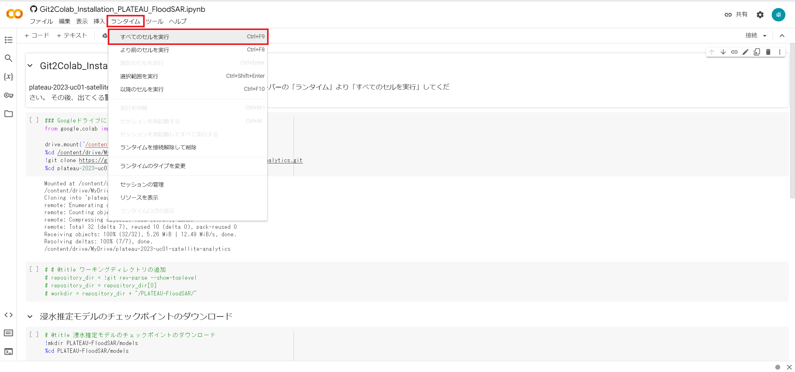
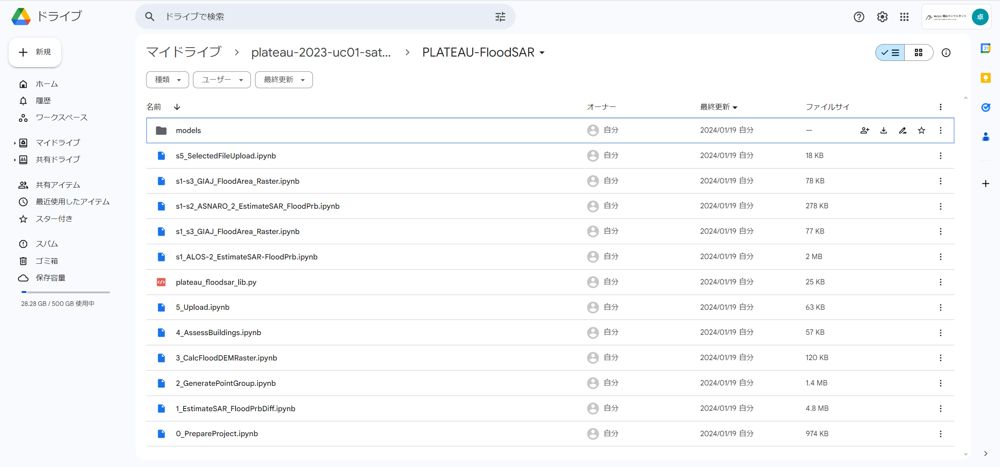

# 環境構築手順書

# 1 本書について

本書では、SAR衛星解析による洪水被害の推定システム（以下「本システム」という。）の利用環境構築手順について記載しています。本システムの構成や仕様の詳細については以下も参考にしてください。

[技術検証レポート](https://www.mlit.go.jp/XXXX)

# 2 動作環境

本システムはGoogle Colaboratoryでの実行を想定しており、動作環境は以下のとおりです。

| 項目               | GoogleColaboratoryでの動作環境（2024/02/01時点） | 推奨環境 |
| ------------------ | --------------------------------------------------------------------------------------------------------------------------------------------------------------------------------------------------------------------------------------------------------------------------------------------------------------------------------- | -------------- |
| CPU                | コア数2，スレッド数4    | 同左 |
| GPU                | Tesla K80 GPU等        | 同左 |
| メモリ             | 12.7GB以上             | 同左 |
| ネットワーク       | クラウド型サービスのためネットワーク環境は必要 | 同左 |

# 3 インストール手順

[こちら](https://colab.research.google.com/github/Project-PLATEAU/SAR-image-based-flood-damage-detector/blob/main/Git2Colab_Installation_PLATEAU_FloodSAR.ipynb)
のプログラムを実行することで、自身のGoogle Drive内に本リポジトリを展開することができます。
メニューバーの「ランタイム」より「すべてのセルを実行」してください。 その後、出てくる警告やアクセス許可を行ってください。

Google Driveに展開されたフォルダ内の「SAR-image-based-flood-damage-detector/PLATEAU-FloodSAR/」に本システムのプログラムが格納されています。

# 4 準備物一覧

本システムを利用するために以下のデータを入手します。

| | データ種別 | 機能                                                                                                                        | 用途                 | 入力方法           |
| ---------- | --------------------------------------------------------------------------------------------------------------------------- | -------------------- | ------------------ | ------------------------------------------------ |
| ①          | 3D都市モデル(CityGML)G空間情報センターから取得します。  https://front.geospatial.jp/                                         | 全般                 | 全般               | 格納フォルダパスもしくはZipのURLを指定                             |
| ②          | 人工衛星観測データ Google Earth Engineにより取得します。  https://earthengine.google.com/         | 全般 | 全般       | APIにより取得          |
| ③          | 解析対象範囲 国土地理院から取得もしくは緯度・経度を直接入力します。  https://maps.gsi.go.jp/ | 全般 | 全般       | GeoJsonファイルをダウンロードしファイルパス指定もしくは緯度・経度により直接指定      |

本システムでは、3D都市モデルの建築物モデルの形状（LOD1）と属性を活用します。

| 地物       | 地物型            | 属性区分 | 属性名                                  | 内容                 |
| ---------- | ----------------- | -------- | --------------------------------------  | -------------------- |
| 建築物LOD1 | bldg:Building     | 空間属性 | bldg:lod1Solid                          | 建築物のLOD1の立体   |
|            |                   |          | bldg:WallSurface                        | 建築物の平面投影形状 |
|            |                   | 主題属性 | bldg:usage　　　　                      | 用途　　             |
|            |                   | 　　　　 | bldg:measuredHeight                     | 計測高さ             |
|            |                   | 　　　　 | bldg:storeysAboveGround                 | 地上階数             |
|            |                   |          | uro:buildingStructureType               | 構造種別             |
