# 操作マニュアル

# 1 本書について

本書では、SAR衛星解析による洪水被害の推定システム（以下「本システム」という）の操作手順について記載しています。

# 2 使い方

## 2-1 Google Drive内に保存されたファイルの起動

- 「マイドライブ」 -> 「SAR-image-based-flood-damage-detector」 -> 「PLATEAU-FloodSAR」に本システムの実行ファイルが展開されています。
- 本システムの実行ファイルである拡張子が「.ipynb」のファイルをGoogle Drive内でダブルクリックすると、Google Colaboratoryが起動します。
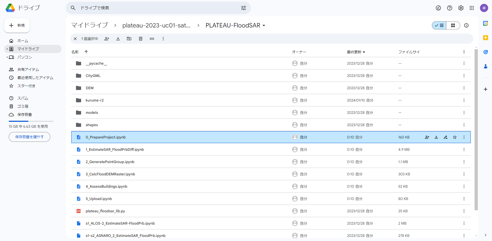
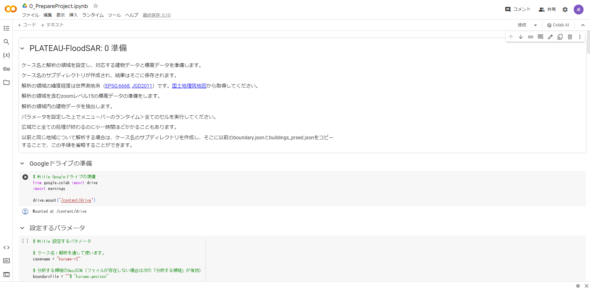

- 以下が実行ファイルの一覧です。本マニュアルでは、福岡県久留米市の令和2年度7月豪雨を対象に欧州宇宙機関が運用するSentinel-1の人工衛星観測データを用いた解析を行います。以下に、メインステップのプログラムについて操作手順を記載します。

| ファイル名 |　内容 |　備考 |
|-|-|-|
| 0_PrepareProject.ipynb | プロジェクトの初期・3D都市モデル（CityGML）の読み込み | メインステップ |
| 1_EstimateSAR-FloodPrbDiff.ipynb | SARデータの読み込み・SARデータによる浸水確率ラスターデータの推定 | メインステップ |
| 2_GeneratePointGroup.ipynb | 浸水ピクセルの生成 | メインステップ |
| 3_CalcFloodDEMRaster.ipynb | 浸水面の標高ラスターデータの生成 | メインステップ |
| 4_AssessBuildings.ipynb | 建物への浸水深付与 | メインステップ |
| 5_Upload.ipynb | 解析データの生成 | メインステップ |
| s1-s3_GIAJ_FloodArea_Raster.ipynb | 国土地理院の浸水推定図（GeoJSON）による浸水面の標高ラスターデータの生成 | サブステップ |
| s1_ALOS-2_EstimateSAR-FloodPrb.ipynb | ALOS-2の分析 | サブステップ |
| s1-s2_ASNARO-2_EstimateSAR_FloodPrb.ipynb | ASNARO-2の分析 | サブステップ |

## 2-2 Google Colaboratoryでの実行（共通事項）

① 実行ファイル内の変数設定

- 各ファイル内の「設定するパラメータ」セルにある変数を設定してください。福岡県久留米市の令和2年度7月豪雨を対象にした解析を行う場合、新たに設定する必要はありません。
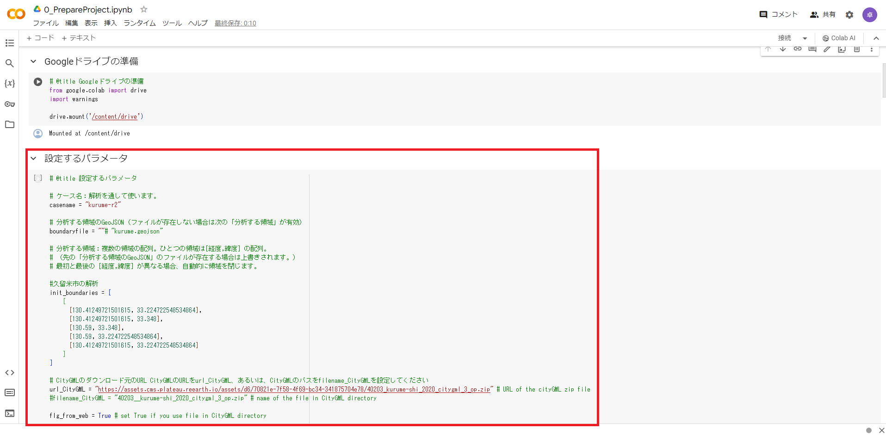

② すべてのセルの実行

- 「ランタイム」ボタンを押し、「すべてのセルを実行」を選択ことでファイルが実行されます。

- Google ColaboratoryによるGoogle Driveへのファイルのアクセス許可を求められるため、許可します。

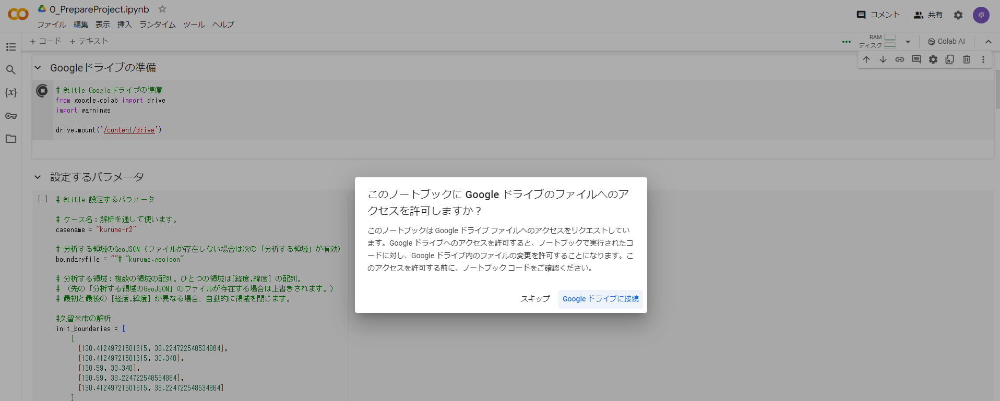

③ 実行の完了

- すべてのセルの実行が完了したら、次の実行ファイルに進んでください。
- セルの実行が完了したら、緑のチェックマークがつきます。

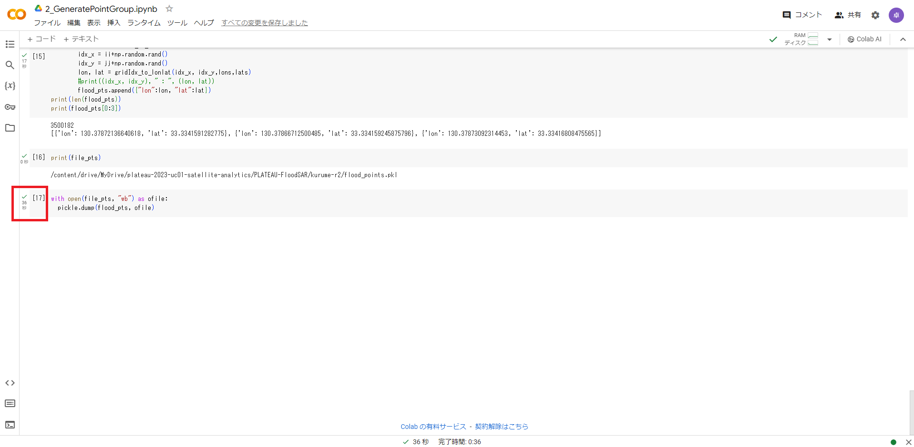

## 2-3 各実行ファイルの操作手順
### 2-3-1 人工衛星観測データの解析（メインブランチ）
#### ⓪プロジェクトの初期・3D都市モデル（CityGML）の読み込み（0_PrepareProject.ipynb）
- 「設定するパラメータ」セルにある変数を設定してください。福岡県久留米市の令和2年度7月豪雨を対象にした解析を行う場合、新たに設定する必要はありません。

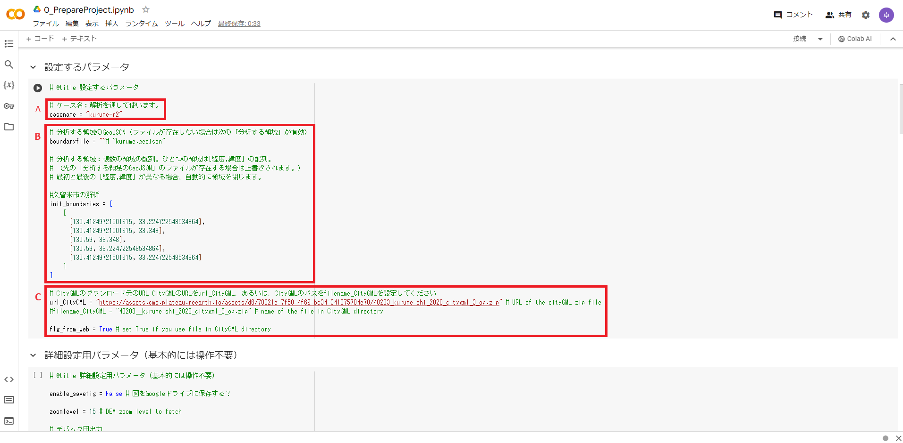

|   | 設定項目          | 変数名          | 内容 | 備考 |
| - | ---------------- | ------------------ | ---------- | -- |
| A | 解析ケース        | casename            | ケース名  | 各ファイル共通 |
| B | 対象エリアの領域  | boundaryfile            | 対象エリアのファイルパス | boundaryfileもしくはinit_boundaliesを設定する   |
|   |                  | init_boundalies        | 対象エリアの緯度・経度情報   | boundaryfileもしくはinit_boundaliesを設定する  |
| C | 解析対象のCityGML | url_CityGML           | CityGMLのダウンロード元のURL | flg_from_web=Trueに設定する   |
|   |                  | filename_CityGML          | CityGMLのパス  | flg_from_web=Falseに設定する   |

- 「ランタイム」ボタンを押し、「すべてのセルを実行」を選択ことでファイルが実行されます。
- Google ColaboratoryによるGoogle Driveへのファイルのアクセス許可を求められるため、許可します。
- CityGMLを解析して、対象エリアの建物データを生成します。また、国土地理院からデジタル標高モデル（DEM、5mメッシュ）をダウンロードします。

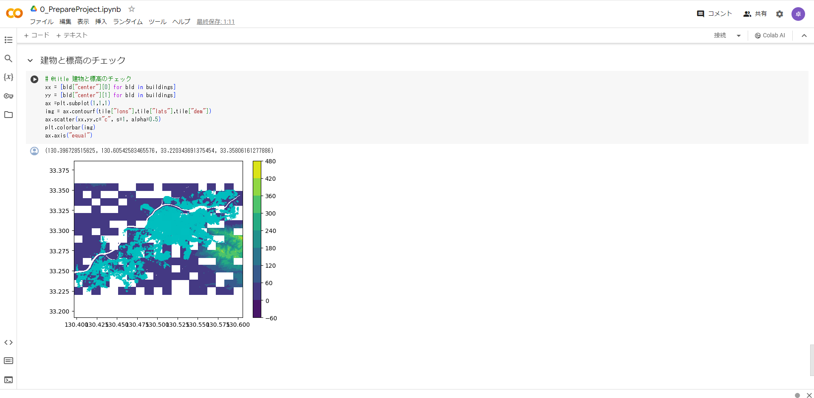

#### ①SARデータの読み込み・SARデータによる浸水確率ラスターデータの推定（1_EstimateSAR-FloodPrbDiff.ipynb）
- 「設定するパラメータ」セルにある変数を設定してください。福岡県久留米市の令和2年度7月豪雨を対象にした解析を行う場合、新たに設定する必要はありません。
- Google Earth Engineのプロジェクト名を設定する必要があります。

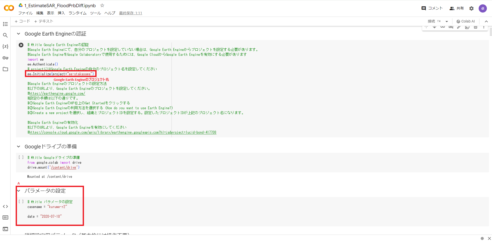

|   | 設定項目          | 変数名          | 内容 | 備考 |
| - | ---------------- | ------------------ | ---------- | -- |
| A | 解析ケース        | casename            | ケース名  | 各ファイル共通 |
|   |                  | date        | 浸水日   | YYYY-MM-DD形式で設定  |

- Google Earth Engineを使用するためには、まずGoogle CloudでGoogle Earth Engine APIを有効化します。
- [Google Cloud](https://console.cloud.google.com/)にアクセスし、APIとサービスを押す。
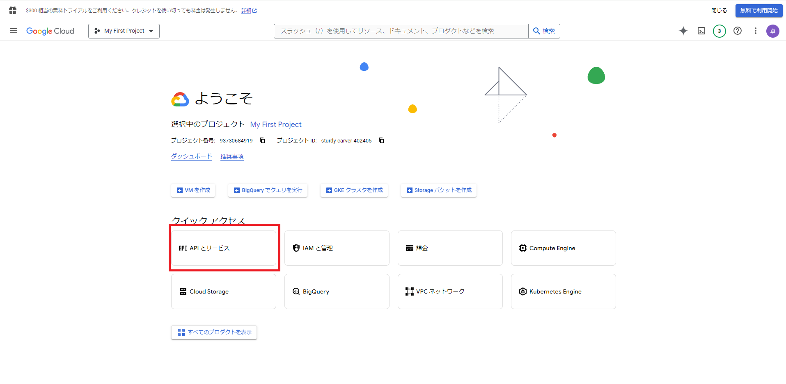

- Google Cloudの新しいプロジェクトを作成する。
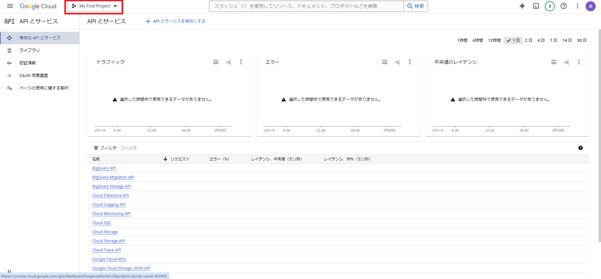

- [Google Earth Engine API](https://console.cloud.google.com/apis/library/earthengine.googleapis.com)にアクセスし、有効化します。
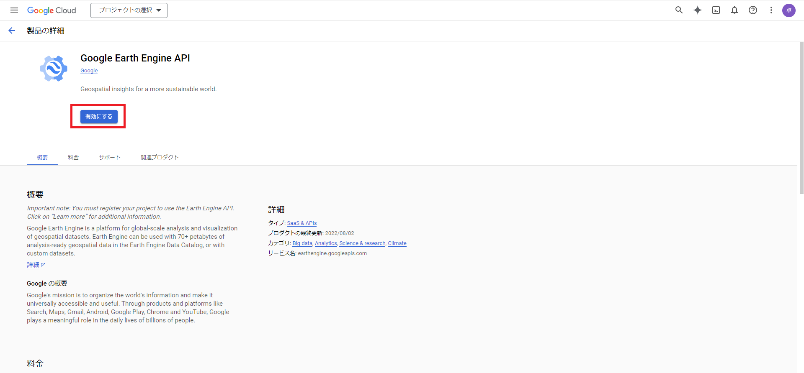

- Google Earth Engine APIが有効化できたら、Google Earth Engineのプロジェクトを作成します。
- [Google Earth Engine](https://earthengine.google.com/)にアクセスし、右上の「Get Started」を押します。

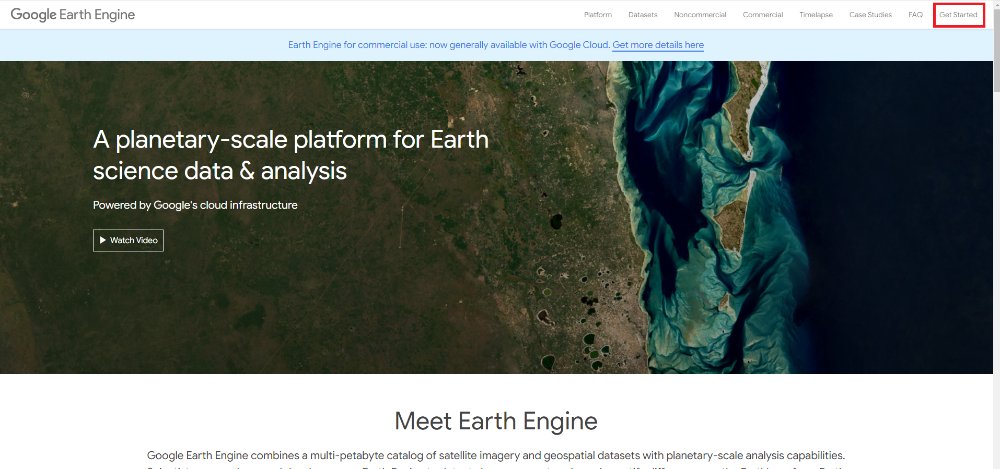

- 「Register a Noncommercial or Commercial Cloud project」を押し、プロジェクトの目的を選択します。
- 「Create a new Google Cloud Project」を選択してプロジェクト名を入力し、「CONTINUE TO SUMMARY」を押します。
- Google Earth Engineのプロジェクトが作成されるので、設定したプロジェクト名をGoogle Colaboratory上で入力します。

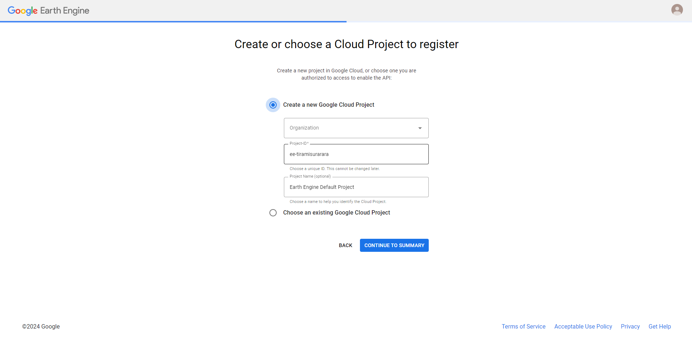
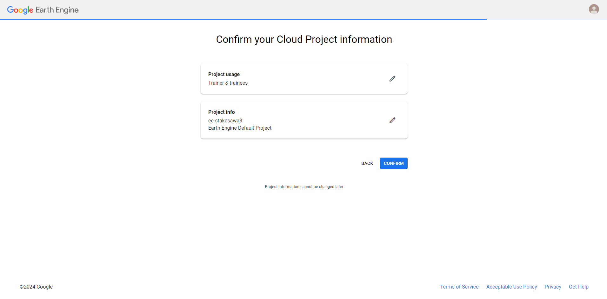

- Google Earth Engineのプロジェクト名を設定してください。

- 「ランタイム」ボタンを押し、「すべてのセルを実行」を選択ことでファイルが実行されます。
- Google ColaboratoryによるGoogle Driveへのファイルのアクセス許可を求められるため、許可します。
- Google Earth Engineにより、対象とする浸水日を指定することで浸水日とその1回帰前のSentinel-1の人工衛星観測データを取得します。
- 取得した人工衛星観測データを使用して、浸水確率学習モデルによりピクセル単位の浸水確率を推定します。
- 浸水時の人工衛星観測データの浸水確率とその1回帰前の人工衛星観測の浸水確率をピクセル単位で差し引きし、浸水時の浸水確率ラスターデータとして出力します。

#### ②浸水ピクセルの生成（2_GeneratePointGroup.ipynb）
- 「設定するパラメータ」セルにある変数を設定してください。

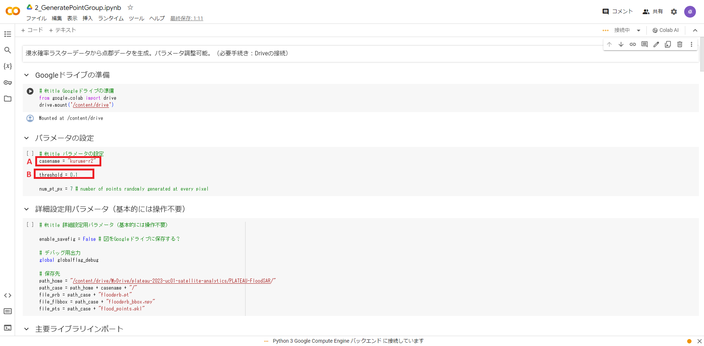

|   | 設定項目          | 変数名          | 内容 | 備考 |
| - | ---------------- | ------------------ | ---------- | -- |
| A | 解析ケース        | casename            | ケース名  | 各ファイル共通 |
| B | 調整可能な衛星解析のパラメータ | threshold	        | 浸水ピクセル判定の閾値   | 0-1で設定  |

- 「ランタイム」ボタンを押し、「すべてのセルを実行」を選択ことでファイルが実行されます。
- Google ColaboratoryによるGoogle Driveへのファイルのアクセス許可を求められるため、許可します。
- ①で生成した浸水確率ラスターデータを使用して、浸水確率が閾値を超えるピクセルを浸水ピクセルと判定します。

#### ③浸水面の標高ラスターデータの生成（3_CalcFloodDEMRaster.ipynb）
- 「設定するパラメータ」セルにある変数を設定してください。福岡県久留米市の令和2年度7月豪雨を対象にした解析を行う場合、新たに設定する必要はありません。

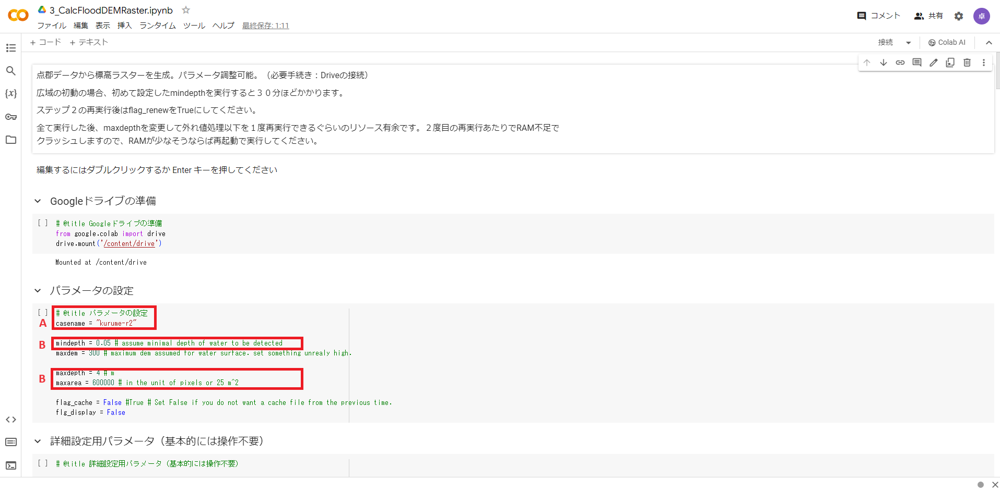

|   | 設定項目          | 変数名          | 内容 | 備考 |
| - | ---------------- | ------------------ | ---------- | -- |
| A | 解析ケース          | casename            | ケース名  | 各ファイル共通 |
| B | 調整可能な衛星解析のパラメータ | mindepth		        | 浸水面の最低水深の設定   | m単位で設定  |
|   |                               | maxarea		        | 浸水面の最大面積の設定   | 25m²単位で設定  |
|   |                               | maxdepth	        | 浸水面の最大水深の設定   | m単位で設定  |

- 「ランタイム」ボタンを押し、「すべてのセルを実行」を選択ことでファイルが実行されます。
- Google ColaboratoryによるGoogle Driveへのファイルのアクセス許可を求められるため、許可します。

- ②で生成した浸水ピクセルから等標高の浸水面を推定し、浸水面の標高ラスターデータを生成します。

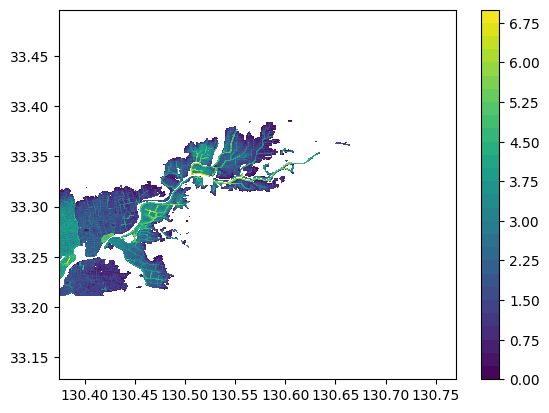

#### ④建物への浸水深付与（4_AssessBuildings.ipynb）
- 「設定するパラメータ」セルにある変数を設定してください。福岡県久留米市の令和2年度7月豪雨を対象にした解析を行う場合、新たに設定する必要はありません。

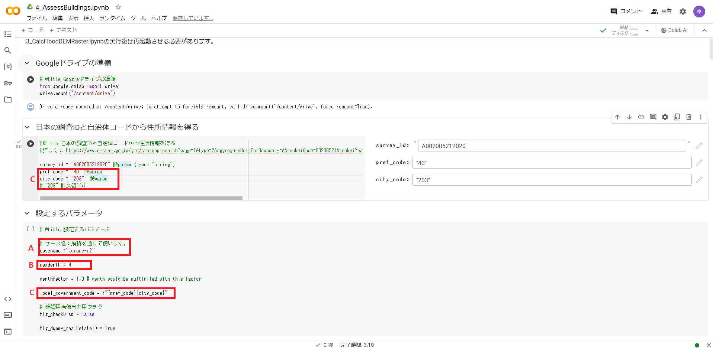

|   | 設定項目          | 変数名          | 内容 | 備考 |
| - | ---------------- | ------------------ | ---------- | -- |
| A | 解析ケース          | casename            | ケース名  | 各ファイル共通 |
| B | 調整可能な衛星解析のパラメータ | maxdepth	        | 浸水面の最大水深の設定   | ③と同じ値を設定  |
| C | 自治体コード | pref_code	        | 都道府県コード   | [e-Stat](https://www.e-stat.go.jp/gis/statmap-search?page=1&type=2&aggregateUnitForBoundary=A&toukeiCode=00200521&toukeiYear=2020&serveyId=A002005212020&coordsys=1&format=shape&datum=2000)より確認  |
|   |             | city_code	        | 市区町村コード   | [e-Stat](https://www.e-stat.go.jp/gis/statmap-search?page=1&type=2&aggregateUnitForBoundary=A&toukeiCode=00200521&toukeiYear=2020&serveyId=A002005212020&coordsys=1&format=shape&datum=2000)より確認  |

- 「ランタイム」ボタンを押し、「すべてのセルを実行」を選択ことでファイルが実行されます。
- Google ColaboratoryによるGoogle Driveへのファイルのアクセス許可を求められるため、許可します。
- ⓪で取得した建物データと③で生成した浸水面の標高ラスターデータを使用して、建物毎の浸水深を算出します。
- 各建物の構造種別と浸水深に基づいて、被災カテゴリとして床上浸水か床下判定かの判定を行います。
- 建物データに浸水深と被災カテゴリを追加した被災建物データ（CSV形式）を生成します。

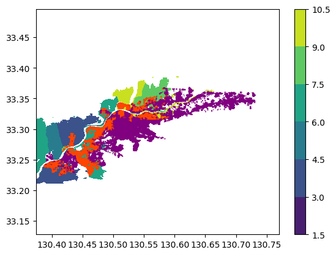

### 2-3-2 解析結果のデータ生成（メインブランチ）
#### ⑤解析データの生成（5_Upload.ipynb）
- 「設定するパラメータ」セルにある変数を設定してください。福岡県久留米市の令和2年度7月豪雨を対象にした解析を行う場合、新たに設定する必要はありません。

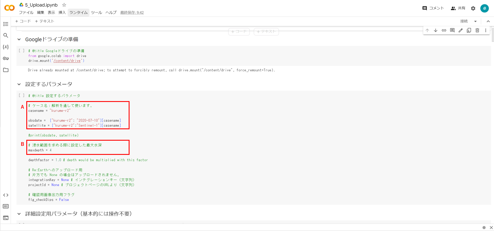

|   | 設定項目          | 変数名          | 内容 | 備考 |
| - | ---------------- | ------------------ | ---------- | -- |
| A | 解析ケース         | casename            | ケース名  | 各ファイル共通 |
|   |                  | obsdate        | 浸水日   | YYYY-MM-DD形式で設定  |
|   |                  | satelite        | 人工衛星名   |  |
| B | 調整可能な衛星解析のパラメータ | maxdepth	        | 浸水面の最大水深の設定   | ③と同じ値を設定  |

- 「ランタイム」ボタンを押し、「すべてのセルを実行」を選択ことでファイルが実行されます。
- Google ColaboratoryによるGoogle Driveへのファイルのアクセス許可を求められるため、許可します。
- ③で生成した浸水面の標高ラスターデータをpng形式の画像タイル及び3D Tiles形式の点群データに変換します。
- ④で生成した被災建物データを集計し、木造家屋の被災カテゴリ別のpng形式のヒートマップ画像タイルを生成します。
- 生成したデータは、Google Drive内に格納されます。

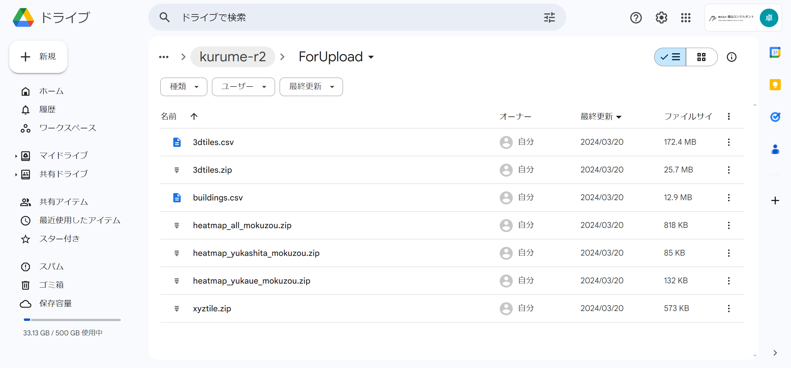

# 3 出力データ

解析で出力されるデータは以下のとおりです。

| 機能                     | 出力データ                               | 内容                                                                                                   | データ形式 |
| ------------------------ | ---------------------------------------- | ------------------------------------------------------------------------------------------------------ | ---------- |
| 人工衛星観測データの解析 | 建物被災状況　                           | 入力したCityGMLの属性をパースし、解析結果の浸水深、被災カテゴリを属性として付与したデータ。            | CSV        |
|                          | 浸水域・浸水深の画像タイル               | 解析結果の浸水域と浸水深を画像タイル化したデータ。                                                     | png        |
|                          | 浸水域・浸水深の3D点群データ             | 解析結果の浸水域と浸水深を3D点群化したデータ。                                                         | 3DTiles    |
|                          | 被災建物のヒートマップ画像タイル         | 木造建物に対して床上浸水、床下浸水、木造家屋総数のヒートマップを画像タイル化したデータ。           | png        |

## 3-1 建物被災状況

建物被災状況は建築物モデルの属性に付与され、入力したCityGMLの建物IDに紐づいてCSV形式で出力されます。

## 3-2 浸水域・浸水深の画像タイル

浸水域・浸水深の画像タイルはpng形式で出力されます。

画像ファイルに位置情報が付与されているため、GISソフト（QGISやArcGIS等）で利用可能です。

## 3-3 浸水域・浸水深の3D点群データ

浸水域・浸水深の3D点群データは3DTilesで出力されます。

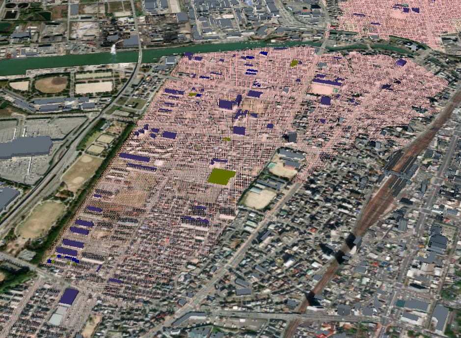

## 3-4 被災建物のヒートマップ画像タイル

被災建物のヒートマップ画像タイルはpng形式で出力されます。

色の閾値は、「4_AssessBuildings.ipynb」のXYZタイル分けされた点郡NPZファイルの生成関数において変更が可能となっています。

画像ファイルに位置情報が付与されているため、GISソフト（QGISやArcGIS等）で利用可能です。

